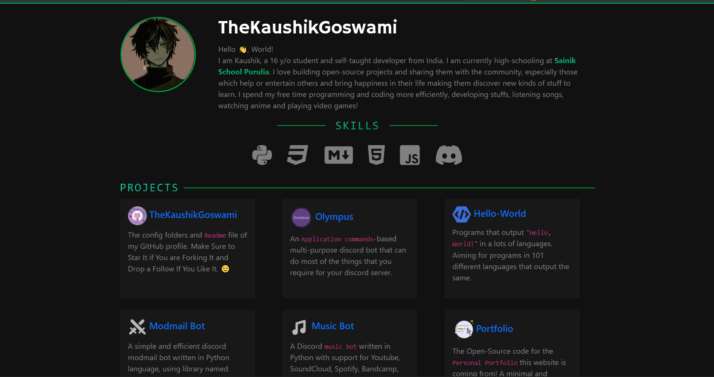

# Personal Portfolio ⚡

> A clean, beautiful, ambient portfolio template for Software Developers!

> https://thekaushikgoswami.github.io

 

[](https://github.com/TheKaushikGoswami/thekaushikgoswami.github.io/commits/master)
[](http://thekaushikgoswami.github.io)

## Website Preview
<a href="https://thekaushikgoswami.github.io" target="_blank">
    
</a><br><br>

> Make Sure to ⭐ the Repo if You liked it -- It Helps!

## 📋 Features

⚡️ Open-Source\
⚡️ Valid HTML5 & CSS3\
⚡️ Easy to modify

## 📦 Installation & Deployment

- Clone the repository and modify the content of <b>index.html</b> according to your requirement.
- Add or remove images from `thekaushikgoswami.github.io/assets/` directory as per your requirement.
- I highly recommend to use [Github Pages](https://docs.github.com/en/pages) to deploy the website in EASIEST WAY.
- To deploy your website, first you need to create github repository with name `<your-github-username>.github.io`. Please don't give any other name.
- Push the generated code to the `master` branch of this repository.

## 📚 Sections

- [x] Profile Picture
- [x] Skills
- [x] Projects
- [x] Connect With Me
- [x] Visitor Count Stats
- [ ] Experience
- [ ] Education
- [ ] Contact Me
- [ ] Resume

To view a live example, **[click here](https://thekaushikgoswami.github.io/)**

## 🛠️ Tools Used

* [<b>Bootstrap v5</b>](https://getbootstrap.com/)
* [<b>Fontawesome</b>](https://fontawesome.com/)
* [<b>Google Fonts</b>](https://fonts.google.com/)
* [<b>Tippy</b>](https://atomiks.github.io/tippyjs/)
* [<b>Elfsight Visitor Counter Widget</b>](https://elfsight.com/visitor-counter-widget/)

## 🚀 Contributing 

### Step 1: Clone The Repo 💡

Fork the repository and then clone it locally by doing -

```bash
git clone https://github.com/TheKaushikGoswami/thekaushikgoswami.github.io.git
```

### Step 2: Build Your Code 🔨

Start your magic by modifying the code and making changes of your own. Then push the commit using -

```bash
git add .
git commit -m "<your commit message here>"
git push YOUR_REPO_URL develop
```

### Step 3: Create a new pull request 🔃

After cloning & setting up the local project you can push the changes to your github fork and make a pull request.

## 🤗 Special Thanks To

- [CTK-Warrior](https://github.com/CTK-WARRIOR/Developer-Portfolio-Template) - For The Base Template of this Portfolio
- [tsParticles](https://github.com/tsparticles/404-templates) - For The Custom 404 Page

------

Made with :heart: in India